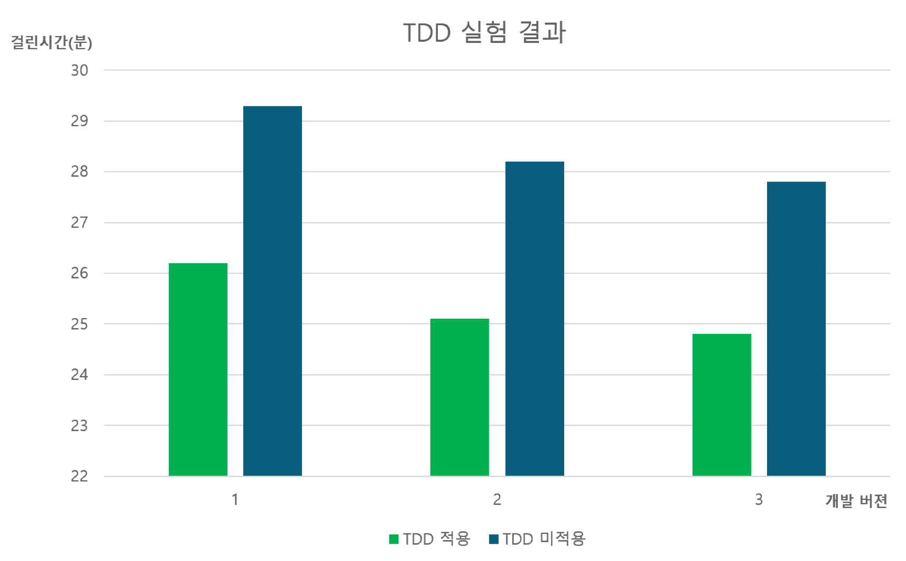

# 1장 ‘설계와 아키텍처란?’

Assign: hyowan
Date: January 10, 2022
Status: 완료

## 설계와 아키텍처란**?**

**설계**? **저수준의** **구조** **또는** **결정사항** **등을** **의미한다**.

**아키텍처란**? **저수준의** **세부사항과는** **분리된** **고수준의** **무언가를** **가리킬** **때** **흔히** **사용한다**.

아키텍처(architecture)란 영어 뜻으로는 구조, 건축물, 건축학 등의 뜻을 가지고 있다.
간단하게 생각해본다면 그냥 소프트웨어 구조라고 말할 수 있다.

**실제로** **하는** **일을** **살펴보면**  **둘을** **구분** **짓는** **건** **무의미하다**.

**저수준의** **세부사항과** **고수준의** **구조는** **모두** **소프트웨어** **전체** **설계의** **구성요소이며**, **대상** **시스템의** **구조를** **정의한다**.

**각자** **개별로는** **존재할** **수** **없고**, **고수준에서** **저수준으로** **향하는** **의사결정의** **연속성만이** **존재한다**.

- 클린 아키텍처에서 소개한 최악의 사례

개발자 : 난 이렇게 열심히 일하는데..
상황이 진척이 없고
기능 추가할때마다 비용이 커..!!!!

경영진 1: 지금 가파르게 성장하려면

개발에 속도가 너무 안나

그러려면 역시 인재 채용이지!

그치만 인건비에 비용이 너무 많이 든다..OMG

경영진 2: 시장을 빨리 선점하기 위해선
빨리 기능 만들어!! 걍 배포해!!

**나중에** **코드** **정리해야지**~ -> **이** **태도가** **변하지** **않는다**.

**이전에** **작성한** **코드도** **정리하지** **않았는데** **다음** **기능을** **만들게** **있고** **계속** **구현만** **하다가**

**결국은** **생산성은** 0**으로** **수렴한다**.

- 클린 아키텍처에서 소개한 좋은 사례 TDD

> 3일은 TDD를 적용해서 정수를 로마 숫자로 변환하는 단순 프로그램
나머지 3일은 아키텍처 적용 없이 그냥 구현했을 때의 그래프 지표
> 

추후에 개발자가 **재설계하더라고** **원래의** **프로젝트처럼** **엉망으로** **내몰린다**.

**개발자** **본인을** **과신하지** **말자,** Like **토끼와** **거북이의** **토끼**

### 빨리 **가는** **유일한** **방법은** **제대로** **가는** 것이다!!!